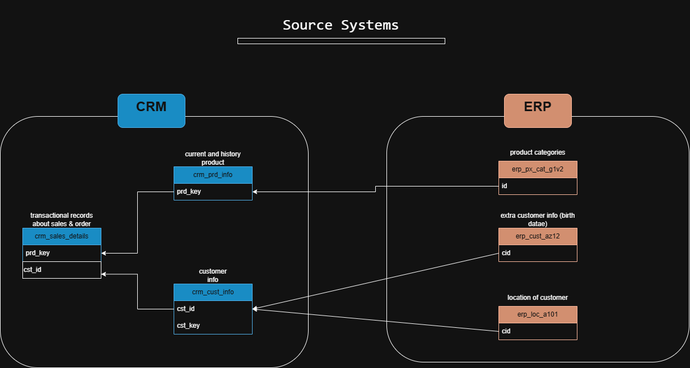

# sql-data-warehouse-project

building a data warehouse with SQL Server , including ETL process , data modeling , and analysis.

This project integrates data from CRM and ERP source systems.

# SQL Data Warehouse Project

## Overview

In this project, I built a simple data warehouse using SQL Server.

The goal is to integrate data from two systems (CRM and ERP) and prepare it for analysis.

---

## Data Sources

The data comes from two systems:

- CRM system (customer data)
- ERP system (product and sales data)

Both sources are provided as CSV files.

---

## Architecture

The project follows a simple layered structure:

- **Bronze layer**: raw data loaded from CSV files  
- **Silver layer**: cleaned and standardized data  
- **Gold layer**: data prepared for analytics

---

## What I Did

- Loaded raw CSV data into SQL Server
- Cleaned and standardized the data
- Checked data quality (NULL values, duplicates, formatting)
- Integrated CRM and ERP data
- Built tables ready for analysis

---

## Goal

The goal of this project is to practice building a basic data warehouse pipeline using SQL.
